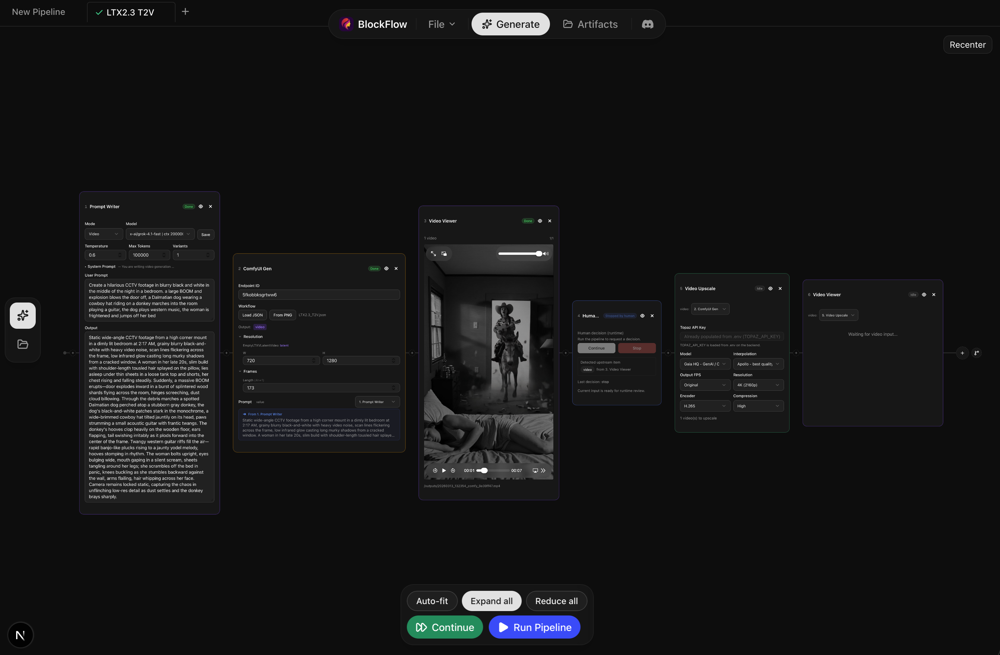
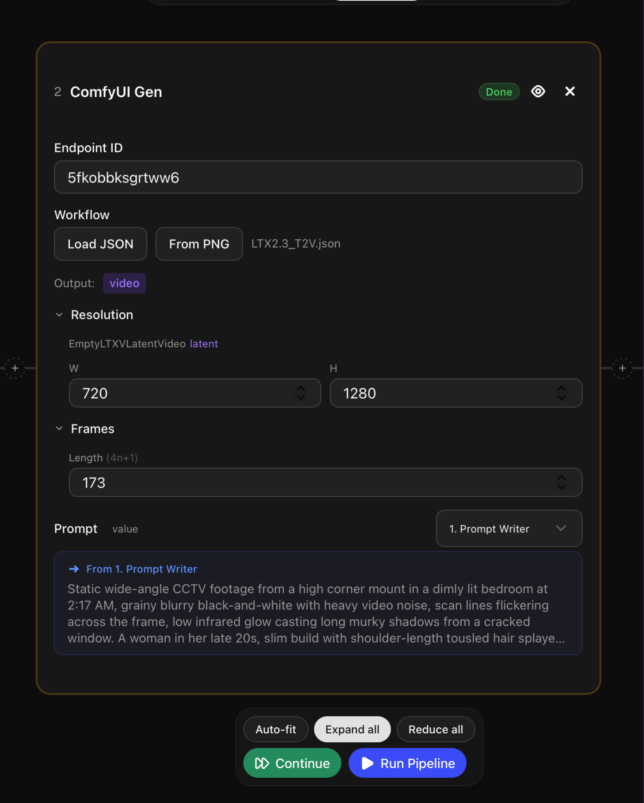
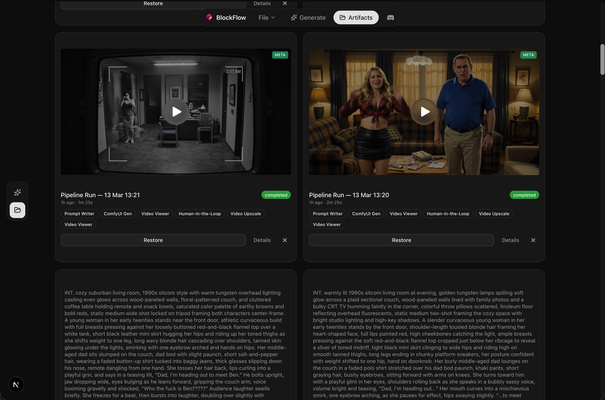

<div align="center">

# BlockFlow

A local-only, browser-based pipeline editor for AI video and image generation.

Build visual workflows by chaining blocks together — prompt generation, ComfyUI workflows, video upscaling, and more — all running on RunPod serverless GPUs.

---

### Pipeline Editor


### ComfyUI Gen Block


### Artifacts


</div>

## Quick Start

```bash
# 1. Clone the repo
git clone <repo-url> && cd blockflow

# 2. Create your .env file
cp .env.example .env
# Edit .env with your API keys (see Configuration below)

# 3. Run
uv run app.py
```

The app starts a FastAPI backend on `:8000` and a Next.js frontend on `:3000` (configurable via `BACKEND_PORT` / `FRONTEND_PORT` env vars), then opens your browser automatically.

## Prerequisites

| Requirement | Purpose | Install |
|-------------|---------|---------|
| **Python 3.12+** | Backend | [python.org](https://www.python.org/) |
| **uv** | Python package runner | `curl -LsSf https://astral.sh/uv/install.sh \| sh` (macOS/Linux) or `powershell -ExecutionPolicy ByPass -c "irm https://astral.sh/uv/install.ps1 \| iex"` (Windows) |
| **Node.js 18+** | Frontend | [nodejs.org](https://nodejs.org/) |
| **ffprobe** | Video metadata extraction | `brew install ffmpeg` (macOS) / `apt install ffmpeg` (Linux) / `winget install ffmpeg` (Windows) |
| **comfy-gen** *(optional)* | ComfyUI workflow execution | `pip install comfy-gen` |

### External Services

You'll need accounts for the services your workflow uses:

| Service | Required? | What For |
|---------|-----------|----------|
| [RunPod](https://runpod.io) | Yes | GPU serverless endpoints for generation |
| [OpenRouter](https://openrouter.ai) | Yes | LLM-powered prompt generation |
| [Topaz Labs](https://www.topazlabs.com/topaz-video-ai) | Optional | Video & image AI upscaling |
| [CivitAI](https://civitai.com) | Optional | Share generated media (advanced mode) |

## Configuration

Create a `.env` file in the project root. The app reads it automatically on startup.

### Required

```env
RUNPOD_API_KEY=rpa_...              # RunPod API key
OPENROUTER_API_KEY=sk-or-v1-...     # OpenRouter API key for prompt generation
```

### Optional Services

```env
TOPAZ_API_KEY=                      # Topaz Labs API key (for upscaling blocks)
CIVITAI_API_KEY=                    # CivitAI API key (for sharing, advanced mode)
RUNPOD_ENDPOINT_ID=                 # Override comfy-gen's configured endpoint ID
```

### Optional Customization

```env
# Generation defaults
DEFAULT_WIDTH=832                   # Default video width
DEFAULT_HEIGHT=480                  # Default video height
DEFAULT_FRAMES=81                   # Default frame count (must be 4n+1: 81, 121, 161...)
DEFAULT_FPS=16                      # Default frames per second

# Prompt writer
DEFAULT_WRITER_MODEL=               # OpenRouter model ID (leave empty for model picker)
DEFAULT_WRITER_TEMPERATURE=0.6      # LLM temperature
DEFAULT_WRITER_MAX_TOKENS=100000    # Max token limit

# Performance
APP_MAX_PARALLEL_WORKERS=6          # Max concurrent generation jobs
RUNPOD_POLL_INTERVAL_SEC=4          # Status polling interval (seconds)
RUNPOD_POLL_TIMEOUT_SEC=2400        # Max wait time per job (seconds)
```

### ComfyUI Setup

The **ComfyUI Gen** block requires the `comfy-gen` CLI tool:

```bash
pip install comfy-gen
comfy-gen config --set runpod_api_key=rpa_...
comfy-gen config --set endpoint_id=<your-comfyui-endpoint>
comfy-gen config --set aws_access_key_id=AKIA...
comfy-gen config --set aws_secret_access_key=...
```

## How It Works

The app uses a **visual block-based pipeline** that flows left to right. Each block performs one task and passes its output to the next.

```
[Prompt Writer] → [ComfyUI Gen] → [Video Viewer] → [Video Upscale] → [Video Viewer]
```

1. **Add blocks** using the `+` button
2. **Configure** each block's settings
3. **Run Pipeline** executes all blocks in sequence
4. **Continue** re-runs from where you left off (skips completed blocks)

Blocks connect automatically based on compatible data types (text, image, video, etc.).

## Available Blocks

### Input & Prompting

| Block | Description |
|-------|-------------|
| **Prompt Writer** | Generate prompts using an LLM. Supports video and image modes with custom system prompts. **Idea generator**: describe a concept and generate multiple prompt variations (4–48) that are batched as a sweep axis in downstream ComfyUI Gen blocks. |
| **I2V Prompt Writer** | Generate a video prompt from an input image using a vision LLM. Specialized for image-to-video transitions. |
| **Upload Image** | Upload a local image file or provide a URL. |
| **Video Loader** | Load videos from URLs, local paths, or file upload. |

### Generation

| Block | Description |
|-------|-------------|
| **ComfyUI Gen** | Run any ComfyUI workflow on RunPod serverless. Load workflows from JSON or extract from PNG metadata. Supports resolution, seed, prompt, and frame count overrides. Auto-detects KSampler nodes (including modular `SamplerCustomAdvanced` workflows) and shows their display names. **Inline LoRA picks**: pick High / Low LoRAs directly on the block; a heuristic maps them onto the detected loader nodes (1 loader → all picks; ≥2 with `high`/`low` labels → split by label; 2 unlabeled → by node order; 0 → warning). **Automation mode**: sweep multiple values (samplers, schedulers, LoRAs, strengths, CFG, steps, prompts) with cartesian product — runs all combinations in parallel with configurable concurrency (1–10). **Missing model detection**: auto-detects missing models and offers one-click download to the endpoint. |
| **Base Model Selector** | Pick the base-model family (Illustrious XL / Z-Image Turbo / Wan 2.2 / LTX Video) and its checkpoint. Feeds downstream blocks so the LoRA Selector shows only compatible LoRAs and ComfyUI Gen swaps in the right checkpoint. Families with zero registered checkpoints are hidden automatically. |
| **LoRA Selector** | Pick one or more LoRAs filtered by the currently-selected base model family. Backed by two sources: an SSH-mounted model volume (production) and a local `comfy_gen_info_cache.json` fallback (default on the mini-PC setup). High / Low branch picks are exposed so 2-pass video workflows can target each branch separately. |

### Viewing

| Block | Description |
|-------|-------------|
| **Video Viewer** | Display generated videos inline with multi-video navigation. Accumulates outputs across runs and auto-selects the newest item. |
| **Image Viewer** | Display generated images in a grid with navigation. Accumulates outputs across runs and auto-selects the newest item. |

### Post-Processing

| Block | Description |
|-------|-------------|
| **Video Upscale** | Upscale videos using Topaz Video AI. Multiple enhancement models, frame interpolation, resolution presets (up to 4K), and encoder options. |
| **Image Upscale** | Upscale images using Topaz AI. Enhancement and sharpening categories with face recovery options. |

### Flow Control

| Block | Description |
|-------|-------------|
| **Human-in-the-Loop** | Manual approval gate. Pauses the pipeline and shows the latest output for you to review before continuing or stopping. |

## Pipeline Features

- **Tabs** — Work on multiple pipelines simultaneously. Double-click to rename, right-click for context menu (rename, duplicate, close).
- **Duplicate tabs** — Clone a tab with all its block configuration via the context menu.
- **Workspaces** — Save all open tabs as a workspace and restore them later from the nav bar.
- **Parallel execution** — Run pipelines in multiple tabs at the same time. Each tab has independent run state and cancellation.
- **Loop mode** — Run a pipeline endlessly until stopped. Click "Loop" instead of "Run" to auto-repeat. Stops automatically on error. Pipelines with Human-in-the-Loop blocks are ineligible.
- **Job manager** — When 2+ pipelines are running, a floating panel appears showing each running tab's name, current block, and a per-tab stop button.
- **Branching** — Fork a pipeline into multiple parallel chains from any block.
- **Iterator blocks** — Blocks like Upload Image and ComfyUI Gen can produce multiple outputs. The pipeline automatically loops downstream once per item, accumulating results across iterations.
- **Continue mode** — After a run completes, add more blocks and click "Continue" to pick up where you left off.
- **Save / Load** — Export pipelines as JSON files and reload them later via File menu. Rename or delete saved flows directly from the nav bar.
- **Auto-fit** — Layout controls (auto-fit, expand all, reduce all) at the bottom of the canvas.
- **Artifacts** — Browse run history with favorites, per-image metadata (synced with gallery navigation), and expandable sub-viewer outputs. Restore any past run as a new tab.
- **Prompt library** — Save and reuse prompts with duplicate name detection (override or keep both).

## Project Structure

```
blockflow/
├── app.py                  # Single entrypoint — starts backend + frontend
├── .env                    # Your API keys (git-ignored)
├── frontend/               # Next.js + React + shadcn/ui
│   └── src/app/m/          # Mobile web UI (separate implementation — see CLAUDE.md)
├── backend/                # FastAPI + Topaz clients + RunPod services
│   └── base_models.py      # Family taxonomy + LoRA classifier
├── custom_blocks/          # Self-contained block definitions
│   ├── <block>/frontend.block.tsx   # Block UI + logic
│   └── <block>/backend.block.py     # Block API routes (optional)
├── tests/                  # Python unit tests (stdlib unittest)
├── skills/                 # AI agent skills for extending BlockFlow
├── flows/                  # Saved pipeline files
└── output/                 # Downloaded generation outputs
```

### Testing

```bash
# Python unit tests (stdlib unittest, no extra deps)
python -m unittest discover -s tests -v

# Frontend unit tests (vitest)
cd frontend && npm test

# End-to-end tests (Playwright)
cd frontend && npm run test:e2e
```

Blocks are self-contained modules. Each block lives in `custom_blocks/<name>/` with a frontend component and an optional backend sidecar. Registration is automatic — just add a folder and restart.

## Tech Stack

- **Frontend**: Next.js 16, React 19, TypeScript, Tailwind CSS, shadcn/ui
- **Backend**: Python 3.12+, FastAPI, uvicorn
- **Database**: SQLite (run history)
- **External**: RunPod API, OpenRouter API, Topaz Labs API, comfy-gen CLI

## Privacy Note

Some pipeline blocks need to send local files (images, videos) to remote services like RunPod for processing. When this happens, files are temporarily uploaded to [tmpfiles.org](https://tmpfiles.org) to make them accessible to the remote GPU. Uploaded files are automatically deleted by tmpfiles.org after a short period. No files are uploaded unless you explicitly run a pipeline that requires remote processing.

## Extensibility — Build Your Own Blocks

BlockFlow is designed to be extended. Every block is a self-contained module — drop a folder into `custom_blocks/` and restart the app.

```
custom_blocks/my_block/
├── frontend.block.tsx    # Required — UI component + execute logic
└── backend.block.py      # Optional — server-side API routes
```

Your `frontend.block.tsx` exports a `blockDef` that declares the block's name, ports, size, and React component. The app discovers it automatically — no manual wiring needed.

### Using AI Agents to Build Blocks

The fastest way to create new blocks is with an AI coding agent. We provide a **BlockFlow Block Builder** skill that teaches agents the full block architecture — port types, execute functions, state persistence, backend sidecars, and UI conventions.

**With [Claude Code](https://claude.com/claude-code):**

Install the skill, then ask naturally:

```
"Add a block that takes a video URL and extracts frames as images"
"Create a block that calls the Replicate API to run a model"
"I need a block that watermarks videos before they go to the viewer"
```

Claude will generate the complete block files, following all BlockFlow conventions.

The skill is included in this repo at [`skills/blockflow-block-builder/`](skills/blockflow-block-builder/).

### Block Quick Reference

| Concept | Details |
|---------|---------|
| **Port types** | `text`, `video`, `image`, `loras`, `metadata` (or any custom string) |
| **Sizes** | `sm` (280x220), `md` (360x320), `lg` (440x460), `huge` (540x580) |
| **State** | Use `useSessionState` for persistent config, `useState` for transient UI |
| **Backend** | Export `router = APIRouter()`, auto-mounted at `/api/blocks/<slug>/` |
| **Validation** | `npm run gen:custom-blocks` validates your block, `npm run build` checks types |

## Troubleshooting

**"comfy-gen CLI not found" warning in ComfyUI Gen block**
The CLI is only required for the Sync button (refreshes the cached LoRA / checkpoint list). Everything else on the block — workflow load, prompt override, run, inline LoRA picks — works fine without it. Install with `pip install comfy-gen` and restart the app, or click the × on the warning banner to dismiss it permanently (stored in `localStorage`).

**Base Model Selector dropdown is empty / missing a family**
Families are auto-hidden when they have zero registered checkpoints. Register a checkpoint by adding a `CheckpointInfo(...)` entry to `KNOWN_CHECKPOINTS` in `backend/base_models.py` and restart.

**Pipeline blocks don't appear after startup**
Make sure the backend is running (check terminal for `[app] Starting FastAPI on :8000`). The frontend fetches available blocks from the backend.

**Video generation times out**
Increase `RUNPOD_POLL_TIMEOUT_SEC` in your `.env`. Default is 2400 seconds (40 minutes).

**Topaz upscaling stuck at "Processing"**
The app has a 10-minute stall detector. If Topaz progress doesn't change for 10 minutes, the job fails with an error. Check your Topaz API key and account status.

**"No video input URLs" error on Upscale block**
Make sure the upstream block has completed and produced video output before continuing the pipeline.

## License

[TBD]

